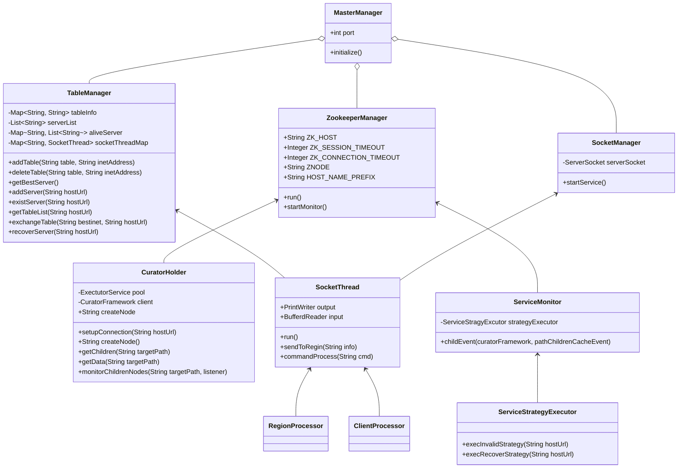
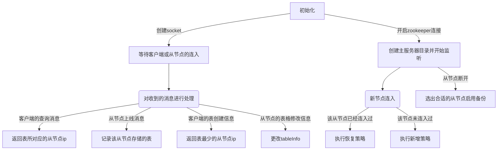

# Master Server个人设计报告

> 姓名：国坤晨
>
> 学号：3200105319
>
> 同组学生：李更新 唐尧

## 简介：

Master Server是我们整个分布式简易数据库系统的核心模块，它承担着与所有Client建立通信，并为其分配通信Region，均衡整个集群负载等重要功能。

## 类图：

## 关键模块解析：（包含通信策略）

- `TableManager`:用于管理所有Table、region节点(server)以及所有socket的信息。

  - `tableInfo`：记录所有表名与存储该表的Region的IP地址的映射关系的Map，即<TableName,IP>;
  - `serverlist`:记录region节点的IP的List，当Region节点上线时，会向MasterServer发送`<region>[1]`，此时Master会将对应的IP地址记录到该List中。恢复策略也是基于检测serverlist实现的。
  - `aliveServer`:记录活跃Region节点的IP，以及所有从节点IP对应的table list.
  - `socketThreadMap`：所有socket都会加入到该Map中，为URL与Socket的映射。
  - 方法：
    - `exchangeTable`为容错容灾模块的处理环节，负责将故障Region的tables记录挂载到执行备份下载的Region(最佳节点)的名下，也即是更新tableInfo和tableList内的内容。

- `ZookeeperManager`:Zookeeper相关模块。

- `SocketManager`：继承MasterManager的TableManager模块，用于管理所有的Socket。

- `CuratorHolder`为启动Zookeeper Watcher的相应程序，用于在Zookeeper集群中启动监听器，监视节点的变化，并将变化内容在Zookeeper中进行修改

- `SocketThread`：output与input为输入流与输出流

  - `sendToRegion(String info)`方法则会在info字符串的头部添加`<master>`字符串，以标识这是由MasterServer发送的消息

  - `commandProcess(String cmd)`方法则会根据socket接收到的内容(cmd)，提取其头部，根据其类别<region>/<client>进行进一步处理

    - 对于client：

      `<client>[1]tablename`:表示这是客户端的查询表格请求，Master将会依据tableInfo中的映射关系将对应的Ip以`<master>[1]ip tablename`的格式发送给客户端。

      `<client>[2]tablename`:表示这是客户端的create table请求，Master将会根据aliveServer中所有的Region进行负载均衡选择后，将负载最小的节点的Ip以`<master>[1]ip tablename`的形式发送给客户端。

    - 对于region：

      `<region>[1]`:表示从节点启动，完成zookeeper的注册后，再将本节点存储的表名通过socket都发给主节点，格式是<region>[1]tbname tbname tbname。

      `<region>[2]`:表示对Region执行delete/add table操作。

      `<region>[3]`:容错容灾处理中使用，表示该Region完成了对失效节点的FTP内容获取，实现了故障节点的内容转移。

      `<region>[4]`:容错容灾处理中使用，表示该Region已经完成了将本地内容删除、恢复到最初状态的操作，请求上线部署。

- `ServiceMonitor`：对服务进行监测。

- `ServiceStrategyExecutor`：具体策略执行的逻辑，包含两类：

  - `Invalid`：失效节点的处理，我们从TableManager类中获取到该失效节点的table list,随后通过`<master>[3]bestInet#table_1@table_2@...`的格式，将该信息发送到当前Region集群中负载最小的节点(bestInet)，同时让最佳Region从FTP服务器上下载对应的故障节点的内容备份，从而完成对节点出错的情况处理。
  - `Recover`：故障节点的恢复，当故障节点恢复后重新与MasterServer建立连接时，MasterServer会从serverlist中发现该Region是故障恢复的状态，所以会向其发送`<master>[4]recover`消息，要求该Region将所有本地备份移除，以最原始的状态加入到当前的Region集群中。随后MasterServer会回显"Recover"信息。

## 流程设计：

## 负载均衡与容错容灾处理：

Master Server采用以下机制使整个系统在一定程度上具备了负载均衡与容错容灾的能力：

负载均衡：

1. 对所有建立连接的Region服务器所存储的table进行记录，在Client发送`create table`的sql请求时，遍历所有的Region服务器，找到存储表单数最小的那个Region，让该sql请求作用于该Region。通过该机制，就实现了存储上的负载均衡。

容错容灾：

1. 节点故障的情况：采用对Zookeeper的目录信息建立单独线程进行监听的方式——当RegionServer发生故障时，顺利的话通过Zookeeper的心跳检测将会找到故障节点，并从目录中删除，如果MasterServer检测到了ZNODE的目录变化，就执行对应的内容转移策略。

2. 故障节点恢复的情况：当一个节点从故障中恢复后，与MasterServer重新建立连接时，MasterServer会检测到新节点的加入，同时发现该节点为故障节点，向其发送`<master>[4]recover`命令，要求其对本地内容进行删除以恢复到初始状态，随后再将其加入到在线的Region列表当中。

   

## 缺点与不足：

1. 在本项目中，MasterSever是唯一的且故障后不可恢复的，我们没有设计在MasterServer故障后的处理方案，即从剩余正常运行的Region中进行新MasterServer的选取。所以当MasterServer挂掉以后，整个系统将无法运作。
2. 恢复策略的设计过于简单，单纯将本地的记录移除，而非恢复到故障前的状态，这一策略会使得在面对真正大规模的数据量时无法保证做到完美的负载均衡。

## 总结：

​	总的来说，本项目是一个较为简易的实践项目，初步实现了课程中要求的负载均衡、容错容灾等构建大规模信息系统的基本要求。虽然存在着很多不足，但在这个开发的过程中，我也收获了很多。